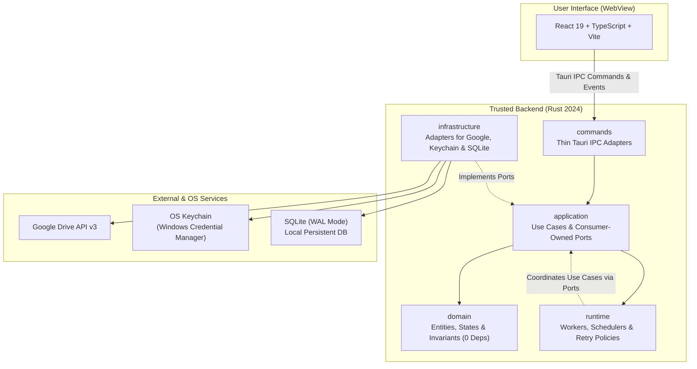
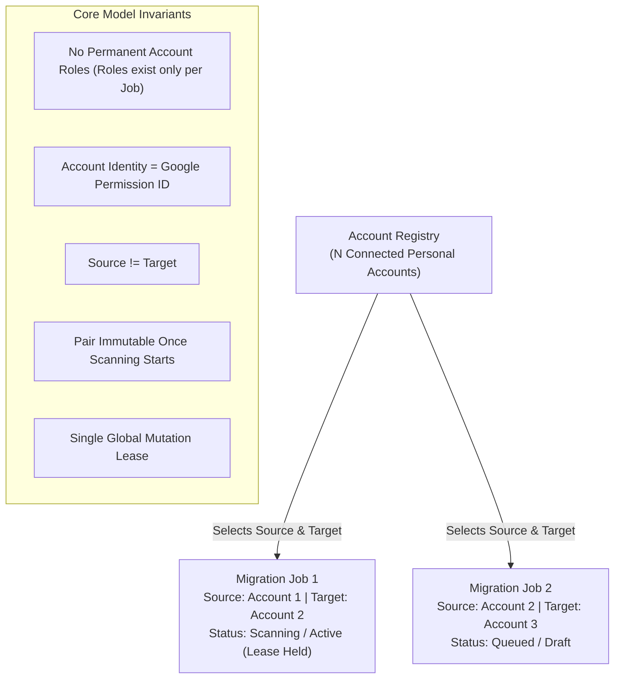
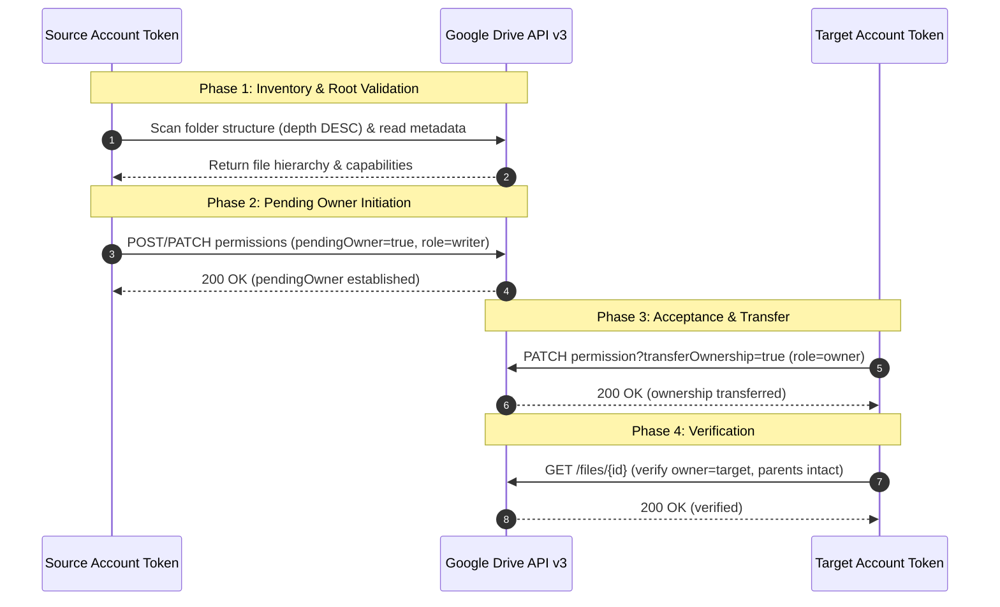

# GDOM System Architecture

This document defines the architectural structure, design principles, boundaries, and security invariants of **Google Drive Owner Migrator (GDOM)**.

---

## 1. System Overview

GDOM is a local-first desktop application engineered to safely and recursively transfer Google Drive file and folder ownership between personal Gmail accounts (`@gmail.com` / `@googlemail.com`).



### Key Architectural Characteristics
- **Local-First & Sovereign**: Runs entirely on the user's desktop (Windows 11 runtime). All credentials, metadata, and checkpoints remain on the local machine.
- **Zero Cloud Intermediary**: No remote server or proxy receives OAuth tokens, user profiles, or Drive metadata.
- **Strict Clean Architecture**: Core domain logic is completely decoupled from UI frameworks, database engines, and Google API SDKs.
- **Deterministic & Resumable**: All state changes are committed to local SQLite storage with WAL mode, enabling seamless cross-session resumption and crash recovery.

---

## 2. Multi-Account Domain Model

GDOM rejects hardcoded "Account A" and "Account B" models. Instead, it operates on a flexible **Account Registry** supporting $N$ accounts with per-job role assignment.



### Invariants:
1. **No Permanent Roles**: Accounts have no intrinsic "source" or "target" role in the registry. Roles exist solely within the context of a specific `MigrationJob`.
2. **Authoritative Identity**: Accounts are identified by Google Drive Permission ID (`about.user.permissionId`), not by email address alone. This prevents identity confusion if an account's primary email or display name changes.
3. **Job Account Pair Immutability**:
   - Exactly one source and one target per job (`source != target`).
   - The `(source, target)` pair can be modified while the job is in `Draft` status.
   - The moment scanning begins (`Scanning`), the pair is **locked and immutable**. Modifying the accounts requires cancelling the job and creating a new one.
4. **Single Active Mutation Lease**: While multiple accounts and draft/queued jobs may exist concurrently, **only one migration job globally may issue live ownership mutations** at any given moment.

---

## 3. Layer Responsibilities & Clean Architecture

The Rust backend is structured into five isolated responsibility boundaries under `src-tauri/src/`:

```
src-tauri/src/
|-- domain/             # Enterprise business rules & invariants
|-- application/        # Application use cases & consumer-owned ports
|-- infrastructure/     # External adapters (Google API, SQLite, Keychain)
|-- runtime/            # Background workers, scheduling, execution loop
|-- commands/           # Thin Tauri IPC adapters
|-- state.rs            # Application state management
+-- lib.rs              # Composition root
```

### 3.1 Domain Layer (`src-tauri/src/domain/`)
- **Responsibility**: Houses core entities (`ConnectedAccount`, `AccountId`, `GooglePermissionId`, `MigrationJob`), value objects, lifecycle state machines, and business rules.
- **Boundary Rules**:
  - **Zero external dependencies**: Must not import `tauri`, `sqlx`/`rusqlite`, `reqwest`, `keyring`, or Google-specific network structs.
  - Pure Rust data structures and deterministic domain validation.

### 3.2 Application Layer (`src-tauri/src/application/`)
- **Responsibility**: Orchestrates domain entities to execute user use cases (e.g., `ConnectAccountService`).
- **Ports & Inversion of Control**:
  - Defines narrow, consumer-owned traits representing required capabilities:
    - `TokenExchangePort`: Exchanges OAuth authorization code for tokens.
    - `IdentityLookupPort`: Retrieves account identity from Google `about.get`.
    - `AccountStorePort`: Persists and queries connected accounts.
    - `RefreshTokenStore`: Securely loads and stores refresh tokens.
    - `AccountTokenProvider`: Provides valid access tokens for specific accounts.
- **Rollback Discipline**: Services ensure transactional rollback (e.g., reverting account record if credential storage fails).

### 3.3 Infrastructure Layer (`src-tauri/src/infrastructure/`)
- **Responsibility**: Implements application ports using concrete technologies:
  - `google_oauth.rs` & `oauth_listener.rs`: PKCE flow, loopback redirect listener, OAuth token exchange.
  - `google_drive.rs`: Google Drive API v3 HTTP client with typed request/response models.
  - `secrets.rs`: Windows Credential Manager adapter via `keyring`.
  - `account_store.rs`: SQLite persistence for account registry and metadata.
- **Sanitization**: Masks secrets in logs; wraps credentials in `SecretString`.

### 3.4 Runtime Layer (`src-tauri/src/runtime/`)
- **Responsibility**: Coordinates active execution loops:
  - Recursive folder scanning worker.
  - Two-phase ownership migration worker.
  - Single-job execution scheduler.
  - Bounded rate limiting and exponential backoff retry policies.
  - Cooperative cancellation via `tokio_util::sync::CancellationToken`.

### 3.5 Commands Layer (`src-tauri/src/commands/`)
- **Responsibility**: Adapts Tauri IPC calls from the frontend:
  - Validates and sanitizes untrusted input from the WebView.
  - Invokes application use cases.
  - Returns typed, serializable DTOs (`Result<T, CommandError>`).
  - Emits typed Tauri events to notify the frontend of progress.

---

## 4. Security & Privacy Architecture

GDOM deals with highly sensitive permissions (full Google Drive access). The architecture enforces strict security controls:

### 4.1 Token Isolation & Keyring Storage
- **Frontend Isolation**: OAuth access and refresh tokens **never** cross the IPC boundary to the React WebView. The frontend only receives opaque account IDs, permission IDs, emails, and display names.
- **Refresh Token Storage**: Refresh tokens are stored exclusively in the OS keychain (Windows Credential Manager for MVP) keyed by internal `AccountId` or `GooglePermissionId`.
- **Access Tokens**: Ephemeral access tokens are held strictly in memory and refreshed on-demand.
- **Redaction**: Credentials, authorization codes, PKCE verifiers, and tokens implement custom `Debug` formats (e.g., `OAuthGrant([REDACTED])`) to prevent accidental log leaks.

### 4.2 OAuth 2.0 PKCE & Loopback Listener
- **Desktop Flow**: Uses OAuth 2.0 Authorization Code flow with PKCE (RFC 7636, S256).
- **System Browser Only**: The authorization URL opens exclusively in the user's default system browser. Authorization is **never** embedded within the Tauri WebView.
- **Loopback Listener Boundary**:
  - Binds strictly to `127.0.0.1:{random_port}`.
  - Capacity-bounded: Admits at most 16 in-flight connections.
  - FIFO Reaping: When connection slots are exhausted, aborts the oldest incomplete connection to prevent deadlock or silent drop of valid redirects.
  - State Validation: Verifies cryptographically secure random `state` before exchanging authorization codes.

### 4.3 Drive Scope & Limited Use
- **Scope Justification**: GDOM requests the full `https://www.googleapis.com/auth/drive` scope because transferring ownership requires listing arbitrary pre-existing user files and folders and updating their ACLs. The restricted `drive.file` scope is insufficient because it only sees files created by or explicitly opened with the app.
- **In-App Justification**: The app displays an explicit explanation of this scope immediately prior to launching the OAuth browser flow.
- **Limited Use Compliance**: GDOM strictly complies with the Google API Services User Data Policy:
  - No human eyes inspect Drive metadata or content.
  - Zero data sent to AI models, machine learning systems, or telemetry backends.
  - No cloud servers store Drive data.

---

## 5. Token Routing Invariant

In consumer Google Drive accounts, ownership transfer requires actions from **both** the current owner and the future owner. GDOM strictly enforces the token routing invariant:



| Operation | Authorized Token | Purpose / Invariant |
|---|---|---|
| **1. Scan folder structure** | Source Account Token | Enumerate source-owned hierarchy leaf-first |
| **2. Read item metadata** | Source Account Token | Check permissions, size, parents, and ownership |
| **3. Create/update pendingOwner** | Source Account Token | Invite target as pending owner (`sendNotificationEmail=true`) |
| **4. Accept ownership transfer** | Target Account Token | Target accepts ownership (`transferOwnership=true`) |
| **5. Verify post-transfer state** | Target Account Token | Verify target became owner and parent IDs remain unchanged |
| **6. Optional source post-check** | Source Account Token | Confirm source is no longer owner |

### Enforcement Rules:
- There is no ambient or "current" account in the backend.
- Every Drive operation must be supplied with an explicit `AccountContext`:
  ```rust
  pub struct AccountContext {
      pub account_id: AccountId,
      pub google_permission_id: GooglePermissionId,
      pub access_token: AccessToken,
  }
  ```
- Tests explicitly verify that source tokens are never used for acceptance, and target tokens are never used for pending-owner initiation.

---

## 6. Two-Phase Transfer Engine & Durability

### 6.1 Recursive Scan & Preflight
1. **Root Validation**: Validates user-supplied folder IDs or URLs using the source token. Rejects items not owned by the source or located in Shared Drives.
2. **Recursive Traversal**: Queries children using pagination (`pageSize=1000`, `trashed=false`), deduplicating across overlapping roots.
3. **Leaf-First Ordering**: Discovered items are ordered by `depth DESC`. Transferring deepest files first ensures child items remain accessible and retains folder hierarchy.
4. **Dry Run & Quota Check**: Evaluates target quota using the target token and presents item summaries to the user.

### 6.2 Mandatory Canary & Transfer Workflow
Before advancing to bulk migration, a job must execute a canary run:
1. **Canary Selection**: A bounded subset of items (default size 5) is selected.
2. **Canary Execution (`RUNNING_CANARY`)**: Runs the transfer algorithm on the canary subset.
3. **Canary Review Gate (`CANARY_REVIEW`)**: Live migration pauses automatically. Bulk execution requires explicit user review and confirmation (re-entering target email). It never advances automatically.
4. **Bulk Execution (`RUNNING`)**: After user confirmation, the remaining eligible items are processed in leaf-first order.

### 6.3 Idempotent Transfer Algorithm
For each item in leaf-first order:
1. **Reconcile**: Read current remote state.
   - If target already owns the item: proceed to verification.
   - If owner is neither source nor target: record permanent failure.
   - If target already has `pendingOwner = true`: proceed to acceptance.
2. **Step 1 (Source)**:
   - If target has no permission: `POST /drive/v3/files/{id}/permissions` with:
     ```json
     {
       "type": "user",
       "role": "writer",
       "emailAddress": "target@gmail.com",
       "pendingOwner": true
     }
     ```
   - If target is already a writer: `PATCH /drive/v3/files/{id}/permissions/{permId}` with:
     ```json
     {
       "role": "writer",
       "pendingOwner": true
     }
     ```
   - Notification emails are mandatory and never suppressed (`sendNotificationEmail=true`).
3. **Step 2 (Target)**:
   - `PATCH /drive/v3/files/{id}/permissions/{permId}?transferOwnership=true` with `role=owner`.
4. **Step 3 (Verify)**:
   - Read item using target token. Verify target is now `owner`, original parent IDs are intact, and item is not trashed.

### 6.4 Rate Limiting & Recovery
- **Default Concurrency**: Scan concurrency is 4; transfer concurrency defaults to 1.
- **Handling `sharingRateLimitExceeded`**:
  - When Google responds with a sharing rate limit, GDOM **never performs fast retries**.
  - The job transitions to `SOURCE_RATE_LIMITED` or `WAITING_FOR_QUOTA`.
  - The pause is committed to SQLite; resumption requires explicit user action after quota reset.
- **Crash Safety & Resume**:
  - Every item state transition is committed transactionally with its corresponding audit event.
  - On restart, unfinished jobs are reconciled against Google Drive before continuing.
